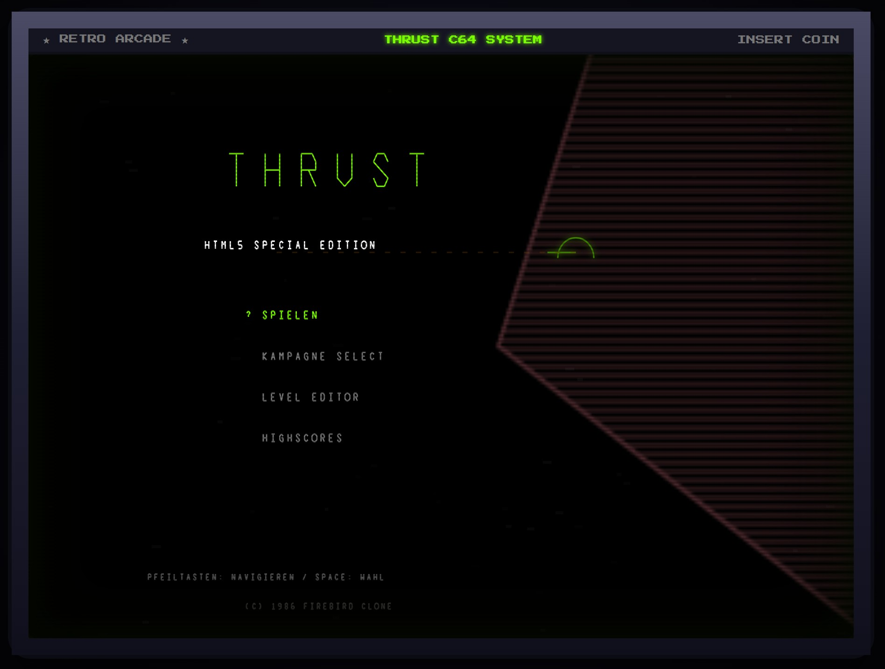
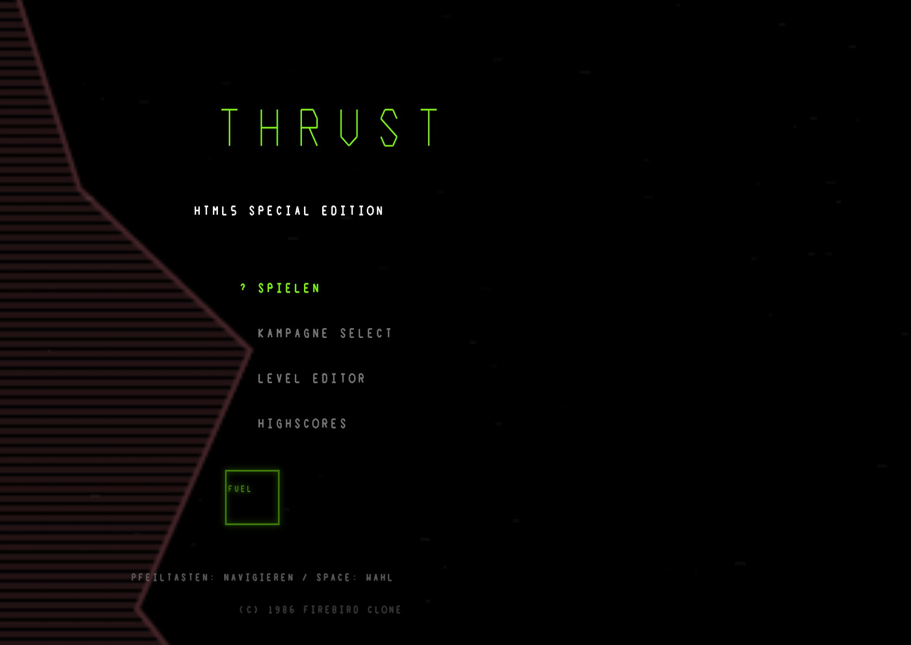
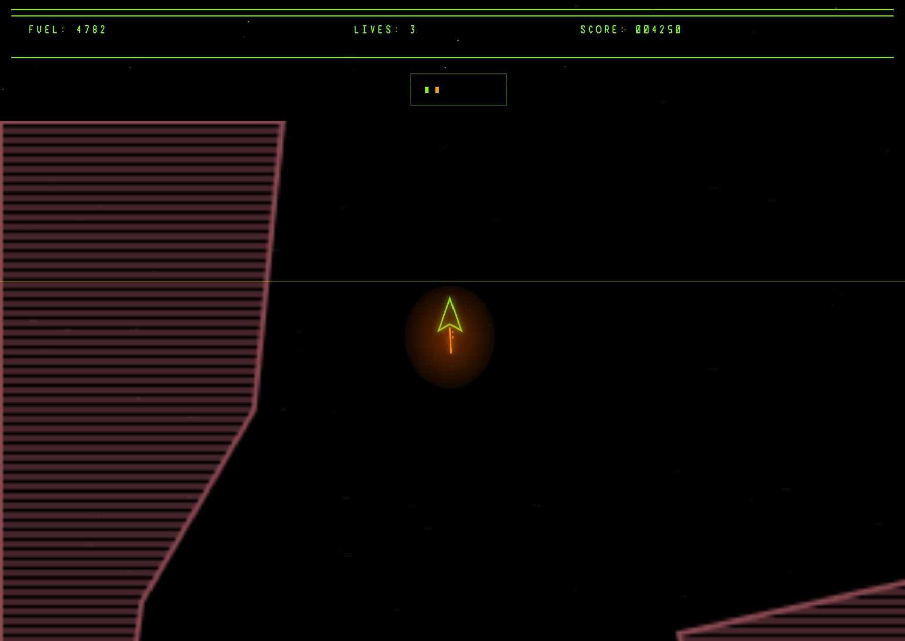
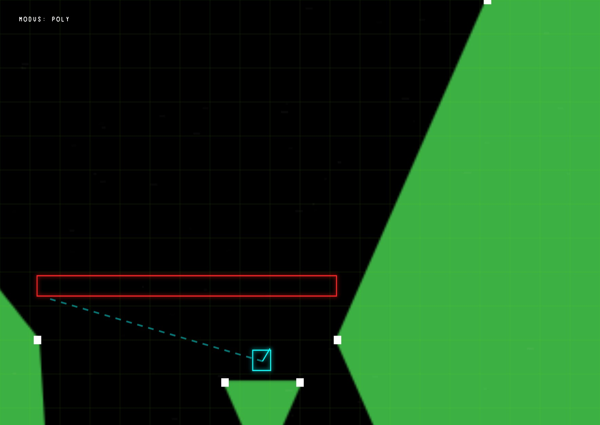

# SCHUBKRAFT — Retro C64 Clone in HTML5




Ein hochentwickelter Retro-Klon des Spieleklassikers von 1986 (hier umbenannt in *Schubkraft*) in modernem HTML5 — komplett ohne Build-Schritt, ohne Frameworks und ohne externe Abhängigkeiten. Das Spiel läuft mit konstanten 60 FPS, rendert vektorbasierte Visuals mit dynamischem Glow (Bloom) und CRT-Effekten, und erzeugt seine gesamte Musik und alle Soundeffekte zur Laufzeit über eine eigene **SID-Chip-Emulation (MOS 6581)** in einem AudioWorklet.

> **Sofort spielen:** `index.html` über einen lokalen Webserver öffnen — fertig. Keine Installation, kein Kompilieren.
>
> **Online spielen:** [enzocage.de/code/schubkraft](https://enzocage.de/code/schubkraft)

---

## Inhaltsverzeichnis

- [Screenshots](#screenshots)
- [Features](#features)
- [Das Spielprinzip](#das-spielprinzip)
- [Die Kampagne](#die-kampagne)
- [Steuerung](#steuerung-controls)
- [Der Level-Editor](#der-level-editor)
- [Technik im Detail](#technik-im-detail)
- [Audio-Engine: SIDForge](#audio-engine-sidforge)
- [Installation / Starten](#installation--starten)
- [Projektstruktur](#projektstruktur)
- [Eigene Levels erstellen & teilen](#eigene-levels-erstellen--teilen)

---

## Screenshots

### Titelbildschirm
Vektorschrift, Parallax-Sternenfeld und rotierender Drahtgitter-Mond — alles in Echtzeit auf einem 320×200-Logikraster gerendert:



### Gameplay
Das Schiff mit aktivem Triebwerk im "Valley of the Giants". Sichtbar: schraffiertes C64-Terrain, Triebwerksflamme mit Partikel-Glow, HUD mit Fuel/Lives/Score und Mini-Radar:



### Level-Editor
Der eingebaute Editor im "Emerald Shaft"-Level (Inverted-Theme): Raster-Overlay, weiße Vertex-Handles, eine rote Kraftfeld-Tür und die gestrichelte Verbindungslinie zum auslösenden Schalter (cyan):



---

## Features

- **Physik & Simulation**
  - PBD-basierte Seilphysik (Verlet-Tether) zwischen Raumschiff und Pendel (Pod) mit Massenverhältnis 1 : 1,6.
  - Subgesteppter symplektischer Euler-Integrator (4 Substeps pro Frame) für präzise Kollisionsauflösung.
  - Segment-basierte Terrain-Kollision über ein räumliches Hash-Grid (64px-Zellen) — auch bei großen Levels konstant schnell.
  - Raycast-Sichtlinienprüfung für Abwehrtürme: Geschütze feuern nur, wenn sie das Schiff tatsächlich "sehen".
- **Retro-Optik**
  - CRT-Scanlines, Flicker-Static und Krümmungs-Vignette (an-/ausschaltbar).
  - Vektor-Bloom (Glow) für Triebwerke, Schilde, Schüsse und Schockwellen.
  - Drei Planeten-Themes: *C64* (rot schraffiert), *Inverted* (grün gefüllt), *BBC* (reine Outlines).
  - Subtile organische Objekt-Animation ("Baba Is You"-Wobble) auf allen Spielobjekten.
  - Arcade-Cabinet-Rahmen mit Bezel-Branding rund um den Bildschirm.
- **Audio**
  - Vollständige 3-Stimmen-SID-Synthese (Dreieck, Sägezahn, Pulse, LFSR-Rauschen, kombinierte Wellenformen, Ringmodulation, Hard-Sync, Multimode-Filter).
  - Titelmusik: **Clair de Lune** (Debussy) — zur Laufzeit aus der beiliegenden MIDI-Datei geparst und in einen 3-Spur-C64-Tracker-Song konvertiert.
  - 20 Soundeffekt-Typen × 10 deterministisch generierte Varianten = 200 SFX, damit nichts zweimal exakt gleich klingt.
  - Prioritätsbasiertes Voice-Stealing wie auf echter Hardware: nur 3 Stimmen, wichtige Sounds gewinnen.
- **Gameplay**
  - 18-Level-Kampagne mit ansteigender Schwerkraft, invertierter Gravitation, Schalter/Tür-Rätseln, Reaktor-Meltdown-Countdown und Endlos-Loop mit Gravitations-Twist.
  - Traktorstrahl zum Ankoppeln des Pendels und Absaugen von Treibstoff.
  - Schild (kostet Fuel) reflektiert Terrain-Aufprälle und feindliche Projektile.
  - Lokale Highscore-Liste (Top 5, localStorage) mit 3-Buchstaben-Arcade-Namenseingabe.
  - Touch-Steuerung für Mobilgeräte (Wisch-Lenkung links, Schub/Feuer/Schild rechts).
- **Level-Editor** — siehe [eigener Abschnitt](#der-level-editor).

---

## Das Spielprinzip

Wie im Original gilt: **Fliegen ist leicht, fliegen mit Anhänger ist die Kunst.**

1. **Eintauchen**: Du startest oberhalb der Höhle und musst dich durch enge Schächte nach unten arbeiten — gegen die Schwerkraft, vorbei an automatischen Abwehrtürmen.
2. **Pendel bergen**: Tief in der Mine wartet das Pendel (der Pod) auf einem Sockel. Mit dem Traktorstrahl (Schild-Taste in der Nähe) koppelst du es an — ab jetzt hängt eine träge Masse an einem starren Seil unter deinem Schiff und verändert das gesamte Flugverhalten.
3. **Reaktor sprengen** *(optional, aber lukrativ)*: Beschieße den Reaktor, bis er überlastet — dann hast du **10 Sekunden** bis zur Kernexplosion. Bonuspunkte und ein dramatischer Abgang inklusive. In den letzten 3 Sekunden wird die Gravitation instabil!
4. **Flucht**: Mit Pendel im Schlepp zurück nach oben über die Fluchtlinie. Ohne Pendel kommst du nicht raus.

Treibstoff ist die zentrale Ressource: Triebwerk, Schild und Traktorstrahl zehren alle davon. Nachschub gibt es aus Fuel-Depots — per Traktorstrahl absaugen (oder zerstören, wenn du sie dem Level lieber wegnimmst, ganz wie im Original).

---

## Die Kampagne

18 handgebaute Levels über drei visuelle Themes, mit stetig steigendem Anspruch:

| #  | Level                 | Theme    | Besonderheit |
|----|-----------------------|----------|--------------|
| 1  | Valley of the Giants  | C64      | Sanfter Einstieg, 2 Türme |
| 2  | The Emerald Shaft     | Inverted | Erste Schalter/Tür-Mechanik |
| 3  | BBC Vector Core       | BBC      | 4 Türme, enge Schächte |
| 4  | The Cavern of Doom    | BBC      | Verwinkelte Kavernen |
| 5  | Reactor Labyrinth     | C64      | Tür-Rätsel + hohe Gravitation |
| 6  | Gravity Inversion     | Inverted | **Invertierte Schwerkraft** |
| 7  | The Defense Grid      | C64      | 4 Türme im Kreuzfeuer |
| 8  | Core Escape           | BBC      | Schwerkraft 0.030 |
| 9  | Volcanic Fissure      | C64      | Enge vulkanische Spalte |
| 10 | Charybdis Gate        | Inverted | Türen versperren den Rückweg |
| 11 | The Gauntlet          | BBC      | 6 Türme — der Spießrutenlauf |
| 12 | Anti-Gravity Zone     | C64      | Invertierte Gravitation, Reaktor oben |
| 13 | The Pit of Shadows    | Inverted | Schwerkraft 0.032, tiefer Abgrund |
| 14 | Switchbacks           | BBC      | Serpentinen + Schaltertür |
| 15 | Turret Fortress       | C64      | **8 Türme** — die Festung |
| 16 | Resonance Core        | Inverted | Doppeltes Tür-Rätsel (2 Schalter) |
| 17 | Heavy Element Cavern  | BBC      | Schwerkraft 0.035 — bleischwer |
| 18 | Final Redoubt         | C64      | Finale: 6 Türme + Türschaltung |

Nach Level 18 beginnt die Kampagne von vorn — **mit invertierter Schwerkraft**.

Über **KAMPAGNE SELECT** im Hauptmenü kann jedes Level direkt angewählt werden.

---

## Steuerung (Controls)

### Gameplay

| Taste | Funktion |
|-------|----------|
| **W** / **↑** | Triebwerk (Schub/Thrust). *Lange halten (> 250 ms) aktiviert zusätzlich Schild/Traktorstrahl.* |
| **A** / **←** | Nach links drehen |
| **D** / **→** | Nach rechts drehen |
| **S** / **Shift** | Schild & Traktorstrahl — zieht das Pendel heran, saugt Treibstoff ab, reflektiert Treffer |
| **Leertaste** | Laser feuern |
| **P** | Pause an/aus |
| **E** | Level-Editor öffnen |

### Titelmenü

| Taste | Funktion |
|-------|----------|
| **↑ / ↓** (oder W/S) | Menüpunkt wählen |
| **Leertaste / Enter** | Bestätigen |

### Touch (Mobile)

- **Linke Bildschirmhälfte**: horizontal wischen = drehen.
- **Rechts unten**: halten = Triebwerk.
- **Rechts oben**: tippen = feuern, zweiter Finger = Schild.

### Level Editor

| Eingabe | Funktion |
|---------|----------|
| **Linksklick** | Polygon-Punkt setzen / Objekt platzieren (je nach Modus) |
| **Klick auf Startpunkt** | Offenes Polygon schließen |
| **Klick auf Objekt** | Eigenschaften-Dialog öffnen (Winkel, Trigger-IDs, Türmaße) |
| **Ziehen von Vertex/Objekt** | Verschieben |
| **Mittelklick-/Shift-Ziehen** | Kamera schwenken (Pan) |
| **WASD / Pfeiltasten** | Kamera bewegen |
| **Zoom + / Zoom −** | Ansicht skalieren (50 % – 200 %) |
| **Z** | Undo (letzte 5 Schritte) |
| **T** | Level sofort testspielen (1 Leben) |
| **E / Escape** | Editor verlassen |

---

## Der Level-Editor

Der vollwertige In-Game-Editor (Menüpunkt **LEVEL EDITOR** oder Taste **E**) macht aus dem Spiel einen Baukasten:

- **Terrain zeichnen**: Polygone Punkt für Punkt setzen; Klick auf den Anfangspunkt schließt die Form. Vertices lassen sich nachträglich ziehen oder löschen.
- **Objekte platzieren**: Treibstoff, Abwehrtürme, Reaktor, Spawn-Punkt, Pendel, Schalter und Kraftfeld-Türen per Auswahlliste.
- **Eigenschaften-Panel**: Turret-Ausrichtung (Winkel-Slider), Tür-Maße sowie frei benennbare Trigger-/Ziel-IDs für Schalter-Tür-Verknüpfungen. Verknüpfungen werden im Editor als gestrichelte Linien visualisiert (siehe Screenshot oben).
- **Level-Einstellungen**: Name, Planet-Theme, Schwerkraft (0.005–0.050), Start-Treibstoff (200–5000) und Grid-Snapping (frei, 4/8/16/32 px).
- **Vorlagen**: Fertige Terrain-Bausteine (Pfeiler, Reaktor-Becken, Lande-Pedestal, Brücke) mit einem Klick einfügen.
- **Undo-System**: Die letzten 5 Bearbeitungsschritte sind rücknehmbar (Z oder Button).
- **Playtest**: Taste **T** startet das Level sofort mit einem Leben — Editor-Zustand bleibt erhalten.
- **Export/Import**: Levels als JSON kopieren, herunterladen oder per Datei/Einfügen importieren.

---

## Technik im Detail

### Rendering

- Logische Auflösung **320×200** (C64-Hommage), skaliert auf die volle Canvas-Größe mit `devicePixelRatio`-Unterstützung.
- Terrain wird einmalig pro Level in ein Offscreen-Canvas **gebacken** (Schraffur/Füllung/Outline je nach Theme) — pro Frame nur noch ein `drawImage`.
- Dreischichtiges Parallax-Sternenfeld plus rotierender Drahtgitter-Mond im Hintergrund.
- Kamera folgt dem Schiff; mit angekoppeltem Pendel verschiebt sich der Fokus auf den gemeinsamen Schwerpunkt. Screen-Shake bei Explosionen, doppelt so stark in den letzten Sekunden des Reaktor-Countdowns.
- Fixed-Timestep-Gameloop (60 Hz Akkumulator) — Physik bleibt deterministisch, unabhängig von der Bildrate des Monitors.

### Physik

- **Verlet-Integration**: Position + alte Position statt expliziter Geschwindigkeit — dadurch ist das starre Tether-Constraint (28 px Seillänge) stabil und energieerhaltend.
- Kollisionsantwort über Penetrations-Projektion mit Normalenermittlung am nächsten Segmentpunkt.
- Schild-Aufprall: elastische Reflexion (Restitution 0.55) gegen 28 Fuel; ohne Schild: Explosion.
- Das Pendel zerschellt oberhalb einer Aufprallgeschwindigkeit, sanfte Landungen federn ab.

### Levelformat

Levels sind schlichtes JSON:

```json
{
  "name": "Mein Level",
  "theme": "c64",
  "gravity": 0.022,
  "fuel": 4000,
  "spawn": { "x": 160, "y": 70 },
  "exitY": 50,
  "polygons": [ [[0,0], [100,0], [90,90]] ],
  "entities": [
    { "type": "pod", "x": 300, "y": 645 },
    { "type": "turret", "x": 420, "y": 350, "angle": 3.14159 },
    { "type": "switch", "x": 300, "y": 490, "target": "tor1" },
    { "type": "door", "x": 180, "y": 450, "w": 160, "h": 10, "trigger": "tor1" }
  ]
}
```

---

## Audio-Engine: SIDForge

Das Herzstück der Klangerzeugung ist **SIDForge** ([js/sidforge.js](js/sidforge.js)) — eine eigenständige Emulation des MOS 6581 SID-Chips als `AudioWorkletProcessor`:

- **3 Stimmen**, jede mit Dreieck-, Sägezahn-, Pulse- (variable Pulsbreite 0–4095) und LFSR-Rauschgenerator; kombinierte Wellenformen (`sawtooth+noise` u. ä.) werden wie beim echten SID gemischt.
- **ADSR-Hüllkurven** mit den originalen 16-stufigen Attack/Decay/Release-Ratentabellen.
- **Ringmodulation** und **Hard-Sync** zwischen benachbarten Stimmen.
- **State-Variable-Multimode-Filter** (LP/BP/HP) mit Resonanz und laufzeitveränderlichem Cutoff-Sweep.
- **50-Hz-Tick** (PAL-Frame-Timing) treibt Sequencer, Pitch-Slides, Arpeggios, Vibrato und Pulsbreitenmodulation — exakt wie ein klassischer C64-Musikplayer.
- **Tracker-Sequencer**: 3 unabhängige Orderlists mit Pattern-Wiederverwendung, Instrumentendefinitionen, Arpeggio- (`0x37`-Stil) und Slide-Effekten.
- **Voice-Stealing nach Priorität**: Soundeffekte verdrängen zuerst freie Stimmen, dann Musikstimmen (Drums vor Lead vor Bass), dann SFX niedrigerer Priorität.

### Clair de Lune als Titelmusik

Beim ersten Start lädt das Spiel `debussy-clair-de-lune.mid`, parst das Binärformat (inkl. Running Status, variabler Delta-Times und Meta-Events) direkt im Browser, quantisiert die Noten auf ein 16tel-Raster und verteilt sie nach Tonhöhe auf drei SID-Stimmen (Bass / Melodie / Harmonie) mit eigens abgestimmten Instrumenten. Schlägt das Laden fehl, springt ein eingebauter SID-Metal-Fallback-Song ein.

### Soundeffekte

Alle 20 SFX-Typen (Laser, Turm-Schuss, drei Explosionsarten, Schild, Traktorstrahl, Triebwerk, Tür-Zischen, Warnsignale, Menü-Sounds u. v. m.) sind als Parameter-Templates definiert. Ein deterministischer Hash-Generator erzeugt daraus je **10 dezente Varianten** (±2 Halbtöne, leichte Hüllkurven-/Filter-/Timing-Streuung), sodass wiederholte Effekte lebendig statt maschinell klingen. Triebwerk, Traktorstrahl und der geschwindigkeitsabhängige Ambient-Drone laufen als Dauer-Sounds mit Live-Frequenzmodulation auf Stimme 3.

---

## Installation / Starten

Das Spiel benötigt keine Compilation und keine Abhängigkeiten — nur einen statischen Webserver (wegen ES-Modulen und MIDI-`fetch` funktioniert reines `file://` nicht in allen Browsern):

```bash
# Variante 1: Node
npx http-server -p 8000

# Variante 2: Python
python -m http.server 8000
```

Danach im Browser `http://localhost:8000` öffnen.

> **Hinweis Audio-Autoplay:** Browser erlauben Ton erst nach einer Nutzereingabe. Der Titelbildschirm zeigt deshalb blinkend „KLICKEN ZUM AKTIVIEREN" — ein beliebiger Tastendruck oder Klick startet die Audio-Engine und die Titelmusik.

Getestet mit aktuellen Versionen von Chrome, Edge und Firefox. Benötigt `AudioWorklet`- und ES-Modul-Unterstützung (alle Browser ab ~2021).

---

## Projektstruktur

```
├── index.html                    # Markup, CRT-Overlays, Editor-Dialoge, Cabinet-Bezel
├── debussy-clair-de-lune.mid     # Titelmusik (wird zur Laufzeit geparst)
├── gfx/                          # Screenshots für dieses README
└── js/
    ├── main.js        # Bootstrap, Gameloop, UI-Bindings, Kampagnen-Auswahl
    ├── constants.js   # Spielzustand, Themes, alle 18 Kampagnen-Level
    ├── physics.js     # Verlet-Integration, Kollision, Entities, Levellogik
    ├── renderer.js    # Canvas-Rendering: Welt, HUD, Menüs, Editor-Overlays
    ├── input.js       # Tastatur-, Maus- und Touch-Eingabe
    ├── editor.js      # Editor-Moduslogik, Undo, Eigenschaften-Panel
    ├── audio.js       # SFX-Templates, Varianten-Generator, MIDI→Tracker-Konverter
    ├── sidforge.js    # SID-Chip-Emulation (AudioWorklet) + Facade-API
    └── vectorFont.js  # Vektor-Strichschrift für alle Ingame-Texte
```

---

## Eigene Levels erstellen & teilen

1. Im Hauptmenü **LEVEL EDITOR** wählen (oder im Spiel **E** drücken).
2. Terrain zeichnen, Objekte setzen, unter **Einstellungen** Theme/Gravitation/Fuel festlegen.
3. Mit **T** testspielen, bis alles passt.
4. **Export** → JSON kopieren oder als Datei herunterladen.
5. Zum Spielen fremder Levels: **Import** → JSON einfügen oder Datei wählen.

Viel Spaß beim Graben, Schleppen und Entkommen! 🚀
